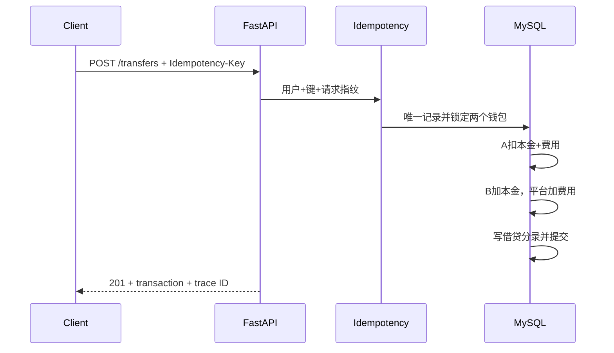
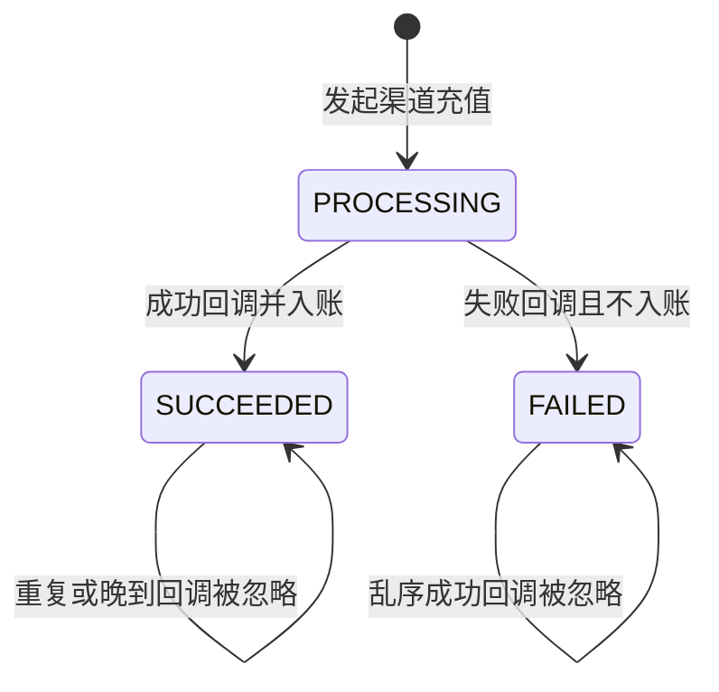

# 系统架构与资金流

## 分层

API层只负责HTTP参数、认证和响应；Application层负责用例编排、事务内资金动作、幂等和回调；Domain层负责Money、手续费和状态机等纯规则；Infrastructure层负责MySQL、SQLAlchemy和可选Redis；Tests独立分为Client、Steps、Factory、Database、Assertions和Cases。

## 转账资金流

## 渠道充值

## 数据表职责

- `wallets`：当前余额快照，便于快速查询。
- `transactions`：业务交易及状态，退款通过父交易关联。
- `ledger_accounts`、`ledger_entries`：不可替代的资金去向与借贷证据。
- `idempotency_records`：请求指纹和首次结果。
- `channel_callbacks`：渠道事件、处理结果和重复次数。
- `fee_rules`：手续费配置和确定性优先级。

钱包余额不能代替账务分录。余额回答“现在有多少钱”，分录回答“为什么变成这些钱”。

## 并发事务与一致性边界

每个HTTP资金请求对应一个MySQL事务。提现先通过`SELECT ... FOR UPDATE`锁定付款钱包，再判断余额、创建交易、扣减余额和写入两条借贷分录；任何一步抛出异常都由Session依赖统一回滚。转账会按钱包ID排序后锁定双方钱包，避免两个相向转账以相反顺序持锁。幂等记录防止重试重复生效，行锁防止不同请求同时读取旧余额，双重记账负责证明资金去向。

## CI/CD质量流

快速流水线服务于每次push和Pull Request：静态检查→接口与金融回归→并发事务门禁→UI Smoke→Allure归档。性能流水线按工作日定时或人工触发：启动隔离MySQL→运行Locust混合负载→检查错误率、P95和RPS→归档HTML/CSV证据。性能结果不会和功能回归混成一个模糊的“测试通过”。
